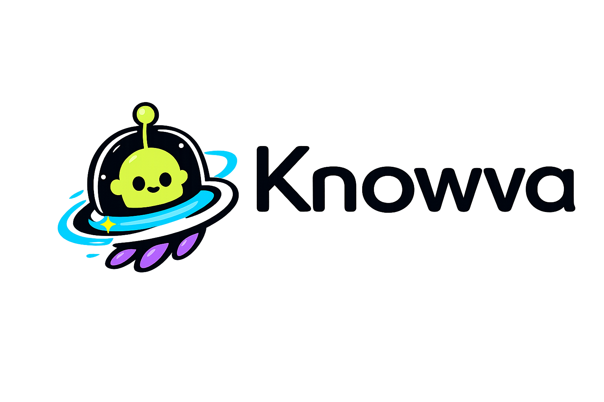
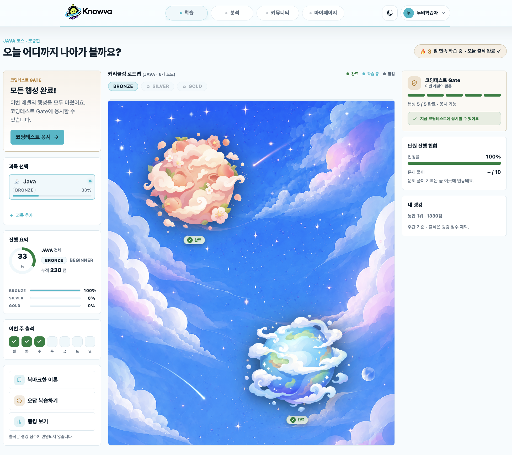
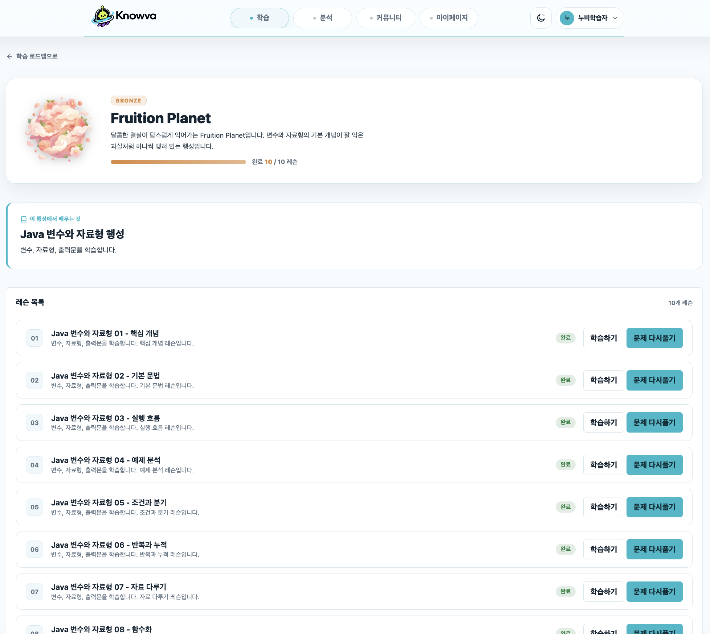
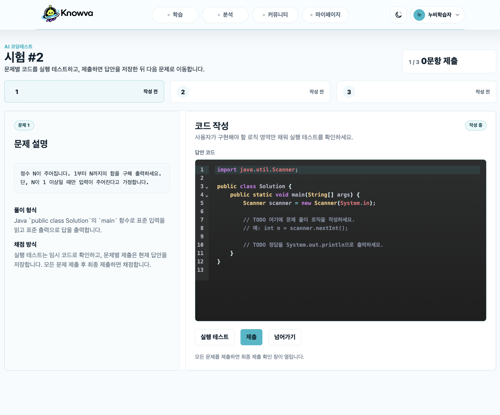
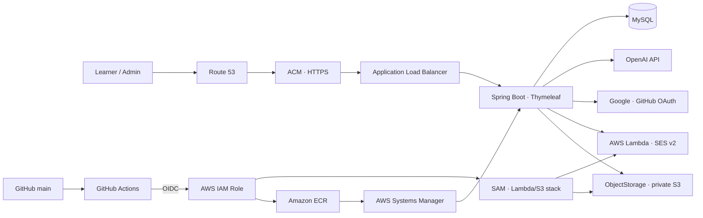

<p align="center">
  
</p>

<h1 align="center">Knowva</h1>

<p align="center">
  <strong>학습의 흐름을 설계하고, AI 피드백으로 다음 행동을 제안하는 게이미피케이션 코딩 학습 플랫폼</strong>
</p>

<p align="center">
  <a href="https://knowvaedu.com">서비스 바로가기</a>
  ·
  <a href="https://app.notion.com/p/E-Knowva-37b04ef58e2a803287a3e65d4ec452b9?source=copy_link">기획·산출물</a>
</p>

> 에이콘 E학습터 최종 프로젝트입니다. <br>
> **문제를 푸는 순간**에서 끝나지 않고, 학습 진도·코딩 테스트·AI 분석·커뮤니티를 하나의 학습 루프로 연결합니다.

## ✨ Why Knowva?

초보 학습자는 무엇을 공부할지, 지금 실력이 어느 정도인지, 다음에 무엇을 보완해야 하는지 판단하기 어렵습니다. Knowva는 과목별 커리큘럼을 **행성 탐험형 로드맵**으로 풀어내고, 레슨 완료와 코딩 테스트 결과를 AI 분석 및 복습 행동으로 연결합니다.

| 학습의 단절 | Knowva의 해결 방식 |
| --- | --- |
| 학습 순서가 보이지 않음 | 행성·레슨·난이도로 구성된 시각적 로드맵과 잠금 해제 |
| 풀고 끝나는 코딩 문제 | 실행 테스트, 채점, 오답 복습, 다음 단계 unlock |
| 피드백이 추상적임 | 제출 이력 기반 AI 분석과 강점·보완점·추천 학습 제안 |
| 혼자 학습하기 지루함 | 과목별 커뮤니티, 학습 기록, 반응, 콘텐츠 추천 |

## 🧭 학습 경험

```text
온보딩 · 과목 선택
        ↓
행성형 커리큘럼 → 레슨 학습 → 코딩 테스트
        ↓                         ↓
   출석 · 랭킹 · 북마크      실행 테스트 · 채점
        ↓                         ↓
        └──── AI 학습 분석 · 오답 복습 ────┘
                         ↓
              과목별 커뮤니티 · 콘텐츠 추천
```

## 🖼️ 서비스 화면

<p align="center">
  
  
  
</p>

<p align="center">
  <sub>학습 로드맵 · 레슨 목록 · 코드 에디터 및 실행 테스트</sub>
</p>

## 🚀 핵심 기능

### 1. 개인화된 학습 로드맵

- Java, Python, SQL, HTML/CSS/JS 과목별 커리큘럼과 Bronze · Silver · Gold 난이도 제공
- 레슨 완료 상태와 난이도 unlock 정책을 기준으로 다음 학습 구간을 제어
- 출석, 누적 점수, 북마크, 오답 복습, 랭킹으로 학습 지속성을 지원

### 2. AI 코딩 테스트와 실행 환경

- 과목·난이도·현재 학습 범위를 반영해 AI가 코딩 테스트 문제를 생성
- 브라우저 에디터에서 코드 작성 후 실행 테스트의 표준 출력으로 즉시 확인
- 사용자 코드와 테스트 케이스를 채점하고, 문제별 제출 상태와 최종 시험 결과를 저장
- AI raw 응답에 정답 로직이 섞여도 학습자에게는 공통 TODO starter code만 전달해 평가 공정성을 유지

### 3. AI 학습 분석

- 시험 결과와 풀이 이력을 바탕으로 강점, 보완점, 다음 학습 행동을 분석
- 요청 토큰과 성공 보고서를 기준으로 중복 분석 생성을 막고, 실패한 생성 요청은 재시도 가능하게 관리
- 분석 결과를 대시보드에서 확인하고 복습 흐름으로 이어갈 수 있음

### 4. 학습 커뮤니티와 추천 콘텐츠

- 과목·게시판·정렬 필터 기반의 커뮤니티, Markdown/기본 모드 에디터, 본문 이미지 첨부 지원
- 댓글, 좋아요, 스크랩, 신고와 관리자 moderation 이력으로 운영 가능한 게시판 구성
- 현재 과목에 맞는 동영상·설치 가이드 등 추천 콘텐츠를 연결

### 5. 계정과 학습 데이터 보호

- 이메일 로그인, Google·GitHub OAuth, 비밀번호 재설정 메일 흐름 제공
- 세션 기반 인증과 역할 기반 관리자 기능 분리
- 공통 예외 응답, validation, idempotency 처리로 API 동작을 일관되게 관리

## ⚙️ 기술 아키텍처



### Deployment flow

`main` push → Gradle test · bootJar → Lambda/S3 SAM build·배포·smoke test → Docker image build (`linux/amd64`) → Amazon ECR push → AWS Systems Manager command → EC2 container replace → `/health` check

GitHub Actions는 long-lived access key 대신 **OIDC로 IAM Role을 assume**해 AWS 배포 권한을 얻는다. 서비스 요청은 Route 53 · ACM · ALB를 거쳐 EC2의 Dockerized Spring Boot 애플리케이션으로 전달된다. 비밀번호 재설정 메일은 EC2가 Lambda를 동기 호출하고 Lambda가 SES API로 발송하며, 첨부·프로필 이미지는 기존 same-origin endpoint를 통해 private S3에서 streaming한다.

메일과 파일 저장은 각각 `MAIL_TRANSPORT=smtp|lambda`, `KNOWVA_STORAGE_MODE=local|mirror|s3`로 단계 전환한다. 기본값은 기존 서비스와의 호환을 위해 `smtp/local`이며, Lambda/S3 검증 후 production 값을 전환한다.

## 🧱 Tech Stack

| 구분 | 기술 |
| --- | --- |
| Backend | Java 17, Spring Boot 4, Spring MVC, Validation, JavaMailSender |
| View | Thymeleaf, HTML/CSS/JavaScript, CodeMirror 기반 코드 에디터, Markdown editor |
| Data | MySQL 8, MyBatis, H2 test runtime |
| AI & Auth | OpenAI API, Google OAuth 2.0, GitHub OAuth, AWS Lambda, Amazon SES v2 |
| Infra | Docker, AWS EC2, private S3, Lambda, ALB, Route 53, ACM, ECR, SAM, Systems Manager |
| CI/CD | GitHub Actions, GitHub Environment, OIDC IAM Role |
| Test | JUnit 5, Spring Boot Test, MyBatis Test, Gradle |

## 📂 프로젝트 구조

```text
.
├── ELearning/
│   ├── src/main/java/com/acorn/elearning/
│   │   ├── learning/     # 온보딩, 커리큘럼, 레슨, 레벨 테스트
│   │   ├── exam/         # AI 코딩 테스트, 실행, 채점
│   │   ├── analysis/     # AI 학습 분석과 대시보드
│   │   ├── community/    # 게시글, 댓글, 반응, 신고
│   │   ├── content/      # 과목별 추천 콘텐츠
│   │   ├── auth/         # 로그인, OAuth, 비밀번호 재설정
│   │   └── common/       # API 응답, 예외, AI client, idempotency
│   ├── src/main/resources/
│   │   ├── templates/    # Thymeleaf screens
│   │   ├── static/       # CSS, JavaScript, 서비스 이미지
│   │   └── mappers/      # MyBatis XML mappers
│   └── Dockerfile
├── docs/
│   ├── ddl/              # DDL, sample data, demo setup data
│   └── 산출물/            # 기획·발표 산출물
├── mail-lambda/           # Java 17 비-Spring password-reset Lambda
├── infra/aws/template.yaml # Lambda, private S3, IAM 정책 SAM template
└── .github/workflows/deploy.yml
```

## 🏁 로컬 실행

### Prerequisites

- JDK 17
- MySQL 8.x
- 환경별 DB, OAuth, OpenAI, mail 설정값

### Run

```bash
# 1. DDL과 sample data 실행
# docs/ddl/Knowva_DDL.sql
# docs/ddl/Knowva_sample_data.sql

# 2. 애플리케이션 실행
cd ELearning
./gradlew bootRun
```

테스트는 아래 명령으로 실행한다.

```bash
cd ELearning
./gradlew test
```

> 환경 변수와 credential은 repository에 포함하지 않는다. 실행 전 `ELearning/src/main/resources/application.properties`가 참조하는 환경별 값을 설정해야 한다.

## 🔗 Links

- Service: [knowvaedu.com](https://knowvaedu.com)
- Planning & deliverables: [E Knowva Notion](https://app.notion.com/p/E-Knowva-37b04ef58e2a803287a3e65d4ec452b9?source=copy_link)
- Database documents: [docs/ddl](docs/ddl)
