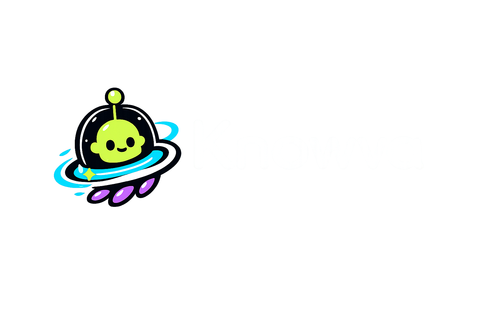
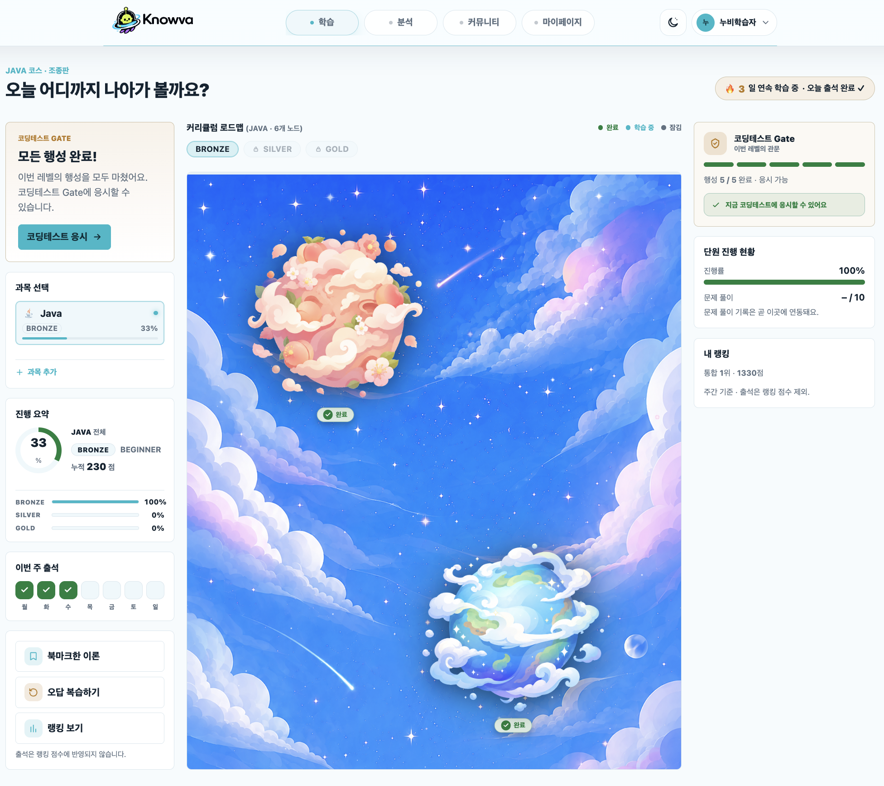
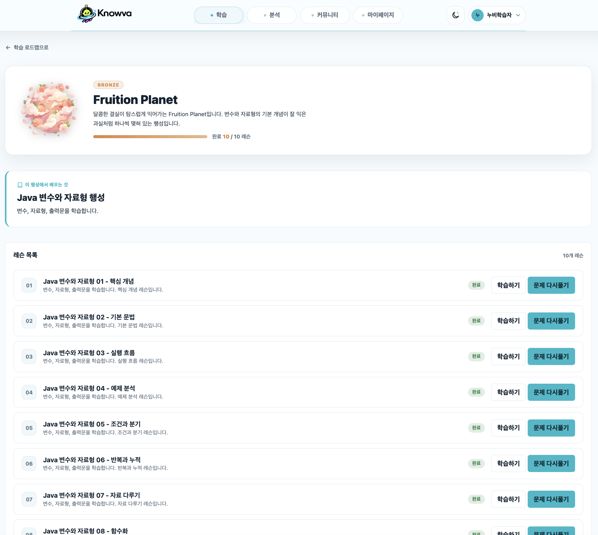
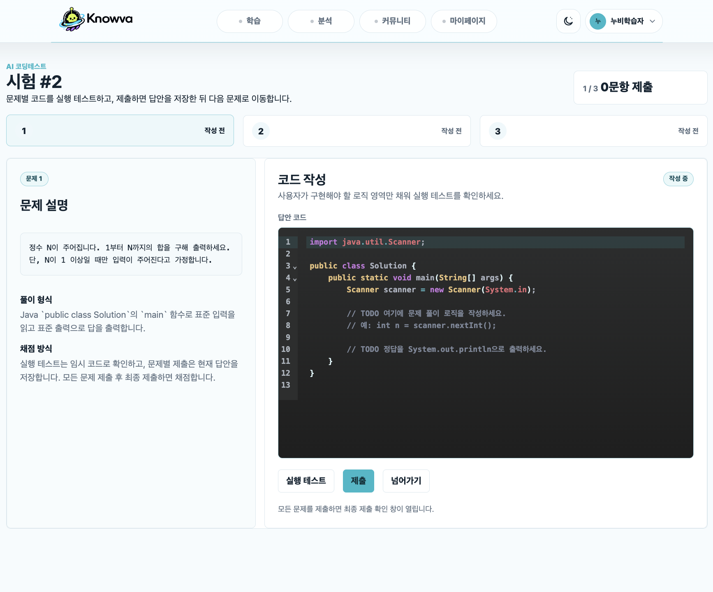
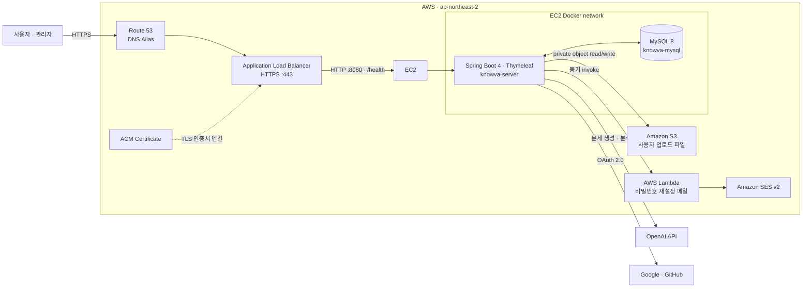
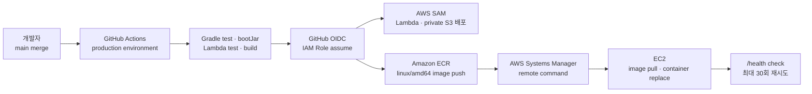

<p align="center">
  
</p>

<h1 align="center">Knowva</h1>

<p align="center">
  <strong>학습의 흐름을 설계하고, AI 피드백으로 다음 행동을 제안하는 게이미피케이션 코딩 학습 플랫폼</strong>
</p>

<p align="center">
  <a href="https://knowvaedu.com">서비스 바로가기</a>
  ·
  <a href="https://app.notion.com/p/E-Knowva-37b04ef58e2a803287a3e65d4ec452b9?source=copy_link">기획·산출물</a>
  ·
  <a href="https://www.youtube.com/watch?v=8a7laRKY914&t=1s">
  시연 영상</a>
</p>

> 에이콘 E학습터 최종 프로젝트입니다. <br>
> **문제를 푸는 순간**에서 끝나지 않고, 학습 진도·코딩 테스트·AI 분석·커뮤니티를 하나의 학습 루프로 연결합니다.

## ✨ Why Knowva?

초보 학습자는 무엇을 공부할지, 지금 실력이 어느 정도인지, 다음에 무엇을 보완해야 하는지 판단하기 어렵습니다. Knowva는 과목별 커리큘럼을 **행성 탐험형 로드맵**으로 풀어내고, 레슨 완료와 코딩 테스트 결과를 AI 분석 및 복습 행동으로 연결합니다.

| 학습의 단절 | Knowva의 해결 방식 |
| --- | --- |
| 학습 순서가 보이지 않음 | 행성·레슨·난이도로 구성된 시각적 로드맵과 잠금 해제 |
| 풀고 끝나는 코딩 문제 | 실행 테스트, 채점, 오답 복습, 다음 단계 unlock |
| 피드백이 추상적임 | 제출 이력 기반 AI 분석과 강점·보완점·추천 학습 제안 |
| 혼자 학습하기 지루함 | 과목별 커뮤니티, 학습 기록, 반응, 콘텐츠 추천 |

## 🧭 학습 경험

```text
온보딩 · 과목 선택
        ↓
행성형 커리큘럼 → 레슨 학습 → 코딩 테스트
        ↓                         ↓
   출석 · 랭킹 · 북마크      실행 테스트 · 채점
        ↓                         ↓
        └──── AI 학습 분석 · 오답 복습 ────┘
                         ↓
              과목별 커뮤니티 · 콘텐츠 추천
```

## 🖼️ 서비스 화면

<p align="center">
  
  
  
</p>

<p align="center">
  <sub>학습 로드맵 · 레슨 목록 · 코드 에디터 및 실행 테스트</sub>
</p>

## 🚀 핵심 기능

### 1. 개인화된 학습 로드맵

- Java, Python, SQL, HTML/CSS/JS 과목별 커리큘럼을 Bronze · Silver · Gold 난이도와 행성 단위 로드맵으로 제공
- 레슨 완료·레벨 테스트·난이도 unlock 정책을 기준으로 다음 행성과 레슨을 해금
- 누비 출석 도장, 누적 점수, 북마크, 오답 복습, 주간·월간 랭킹으로 학습 지속성을 지원

### 2. AI 코딩 테스트와 실행 환경

- 과목·난이도·현재 학습 범위를 반영해 AI가 코딩 테스트 문제를 생성
- CodeMirror 6 에디터에서 코드 작성 후 실행 테스트의 표준 출력으로 즉시 확인하고, 실행 이력이 있어야 제출 가능
- 사용자 코드와 테스트 케이스를 채점하고, 문제별 제출 상태와 최종 시험 결과를 저장
- AI raw 응답에 정답 로직이 섞여도 학습자·분석 AI에는 공통 TODO starter code만 전달해 평가 공정성을 유지

### 3. AI 학습 분석

- 시험 결과와 풀이 이력을 바탕으로 강점, 보완점, 다음 학습 행동을 분석
- 요청 토큰과 성공 보고서를 기준으로 중복 분석 생성을 막고, 실패한 생성 요청은 재시도 가능하게 관리
- 분석 결과를 대시보드와 오답 복습 흐름으로 연결

### 4. 학습 커뮤니티와 추천 콘텐츠

- 과목·게시판·정렬 필터 기반의 커뮤니티와 Milkdown 기반 Markdown/기본 모드 에디터 제공
- 본문 이미지 첨부, 댓글, 좋아요, 스크랩, 신고와 관리자 moderation 이력으로 운영 가능한 게시판 구성
- 현재 과목에 맞는 동영상·설치 가이드 등 추천 콘텐츠를 연결

- 오답노트를 Markdown 파일로 내려받거나 커뮤니티 게시글 초안으로 이어서 작성 가능

### 5. 계정·결제·권한 관리

- 이메일 로그인, Google·GitHub OAuth, Lambda·SES 기반 비밀번호 재설정 메일 흐름 제공
- 세션 기반 인증과 사용자·관리자 역할 분리, 공통 validation·예외 응답·idempotency 처리 적용
- Kakao Pay와 Toss Payments 기반 프리미엄 결제·권한 부여 흐름 제공

## ⚙️ 운영 아키텍처


```mermaid
flowchart LR
    USER["사용자 · 관리자"] -->|"HTTPS"| DNS["Route 53\nDNS Alias"]

    subgraph AWS["AWS · ap-northeast-2"]
        DNS --> ALB["Application Load Balancer\nHTTPS :443"]
        ACM["ACM Certificate"] -. "TLS 인증서 연결" .-> ALB
        ALB -->|"HTTP :8080 · /health"| EC2["EC2"]

        subgraph HOST["EC2 Docker network"]
            APP["Spring Boot 4 · Thymeleaf\nknowva-server"]
            DB[("MySQL 8\nknowva-mysql")]
            APP <--> DB
        end

        EC2 --> APP
        APP -->|"private object read/write"| S3["Amazon S3\n사용자 업로드 파일"]
        APP -->|"동기 invoke"| LAMBDA["AWS Lambda\n비밀번호 재설정 메일"]
        LAMBDA --> SES["Amazon SES v2"]
    end

    APP -->|"문제 생성 · 분석"| OPENAI["OpenAI API"]
    APP -->|"OAuth 2.0"| OAUTH["Google · GitHub"]
```

- Route 53 alias가 ALB로 요청을 전달하고, ACM 인증서가 연결된 ALB가 HTTPS를 종료한다.
- ALB는 `/health` 상태 검사를 통과한 EC2의 Dockerized Spring Boot 앱으로만 요청을 전달한다. 앱과 MySQL은 같은 Docker network에서 통신한다.
- 업로드 파일은 private S3에 저장하고, 브라우저에는 S3 URL을 직접 노출하지 않는다. 앱의 same-origin endpoint가 권한을 확인한 뒤 streaming한다.
- 비밀번호 재설정은 EC2 앱이 Lambda를 동기 호출하고, Lambda가 SES v2로 메일을 전송한다.

## 🚚 배포 흐름


```mermaid
flowchart LR
    DEV["개발자\nmain merge"] --> GA["GitHub Actions\nproduction environment"]
    GA --> BUILD["Gradle test · bootJar\nLambda test · build"]
    BUILD --> OIDC["GitHub OIDC\nIAM Role assume"]
    OIDC --> SAM["AWS SAM\nLambda · private S3 배포"]
    OIDC --> ECR["Amazon ECR\nlinux/amd64 image push"]
    ECR --> SSM["AWS Systems Manager\nremote command"]
    SSM --> EC2["EC2\nimage pull · container replace"]
    EC2 --> HEALTH["/health check\n최대 30회 재시도"]
```

1. `main` push 또는 수동 실행이 production GitHub Environment의 workflow를 시작한다.
2. Spring Boot test·`bootJar`와 Lambda test·build를 통과한 뒤 GitHub OIDC로 AWS IAM Role을 assume한다. long-lived AWS access key는 저장하지 않는다.
3. SAM이 Lambda와 private S3를 배포하고, Lambda에 invalid request smoke test를 수행한다.
4. Git SHA 태그와 `latest` 태그의 `linux/amd64` Docker image를 ECR에 push한다.
5. SSM이 EC2에서 새 image를 pull하고, S3 모드면 기존 로컬 업로드를 동기화한 뒤 컨테이너를 교체한다.
6. `http://localhost:8080/health`가 최대 30회 안에 성공해야 deployment가 완료된다.

운영은 `MAIL_TRANSPORT=lambda`, `KNOWVA_STORAGE_MODE=s3`로 Lambda·SES와 private S3를 사용한다. 전환·복구를 위해 코드 차원에서는 `smtp|lambda`, `local|mirror|s3` adapter도 유지한다.

## 🧱 Tech Stack

| 구분 | 기술 |
| --- | --- |
| Backend | Java 17, Spring Boot 4.0.6, Spring MVC, Spring Security, Validation, MyBatis |
| View | Thymeleaf, HTML/CSS/JavaScript, CodeMirror 6, Milkdown 7, Marked, DOMPurify, esbuild |
| Data | MySQL 8, MyBatis, H2 test runtime |
| AI · External | OpenAI API, Google OAuth 2.0, GitHub OAuth, Kakao Pay, Toss Payments |
| Infra | Docker, EC2, ALB, Route 53, ACM, ECR, Systems Manager, Lambda, SES v2, private S3, AWS SAM |
| CI/CD | GitHub Actions, GitHub Environment, OIDC IAM Role |
| Test | JUnit 5, Spring Boot Test, MyBatis Test, H2, Gradle |

## 📂 프로젝트 구조

```text
.
├── ELearning/
│   ├── src/main/java/com/acorn/elearning/
│   │   ├── learning/     # 온보딩, 커리큘럼, 레슨, 레벨 테스트
│   │   ├── exam/         # AI 코딩 테스트, 실행, 채점
│   │   ├── analysis/     # AI 학습 분석과 대시보드
│   │   ├── community/    # 게시글, 댓글, 반응, 신고
│   │   ├── practice/     # 문제 풀이와 오답노트
│   │   ├── ranking/      # 점수·주간/월간 랭킹
│   │   ├── content/      # 과목별 추천 콘텐츠
│   │   ├── auth/         # 로그인, OAuth, Lambda 비밀번호 재설정
│   │   ├── payment/      # 프리미엄 결제와 권한 부여
│   │   ├── storage/      # local/mirror/S3 object storage adapter
│   │   └── common/       # API 응답, 예외, AI client, idempotency
│   ├── src/main/resources/
│   │   ├── templates/    # Thymeleaf screens
│   │   ├── static/       # CSS, JavaScript, 서비스 이미지
│   │   └── mappers/      # MyBatis XML mappers
│   ├── src/main/frontend/ # CodeMirror·Milkdown bundle source
│   └── Dockerfile
├── docs/
│   ├── sql/              # DDL, demo setup, curriculum, community seed data
│   └── 최종 문서/         # WBS, 발표 자료 등 최종 산출물
├── mail-lambda/           # Java 17 기반 SES v2 password-reset Lambda
├── infra/aws/template.yaml # Lambda, private S3, EC2 runtime IAM 정책 SAM template
└── .github/workflows/deploy.yml
```

## 🔗 Links

- Service: [knowvaedu.com](https://knowvaedu.com)
- Planning & deliverables: [E Knowva Notion](https://app.notion.com/p/E-Knowva-37b04ef58e2a803287a3e65d4ec452b9?source=copy_link)
- Database documents: [docs/sql](docs/sql)
